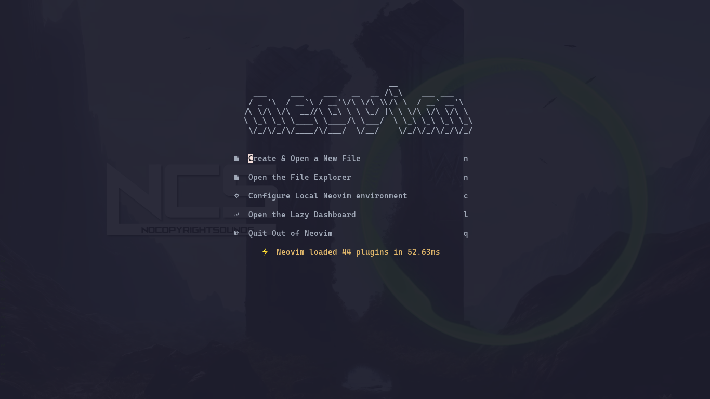
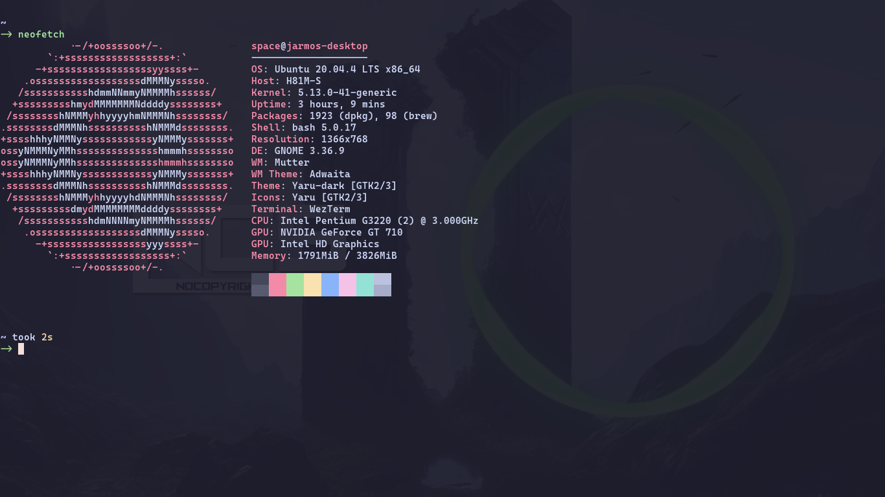
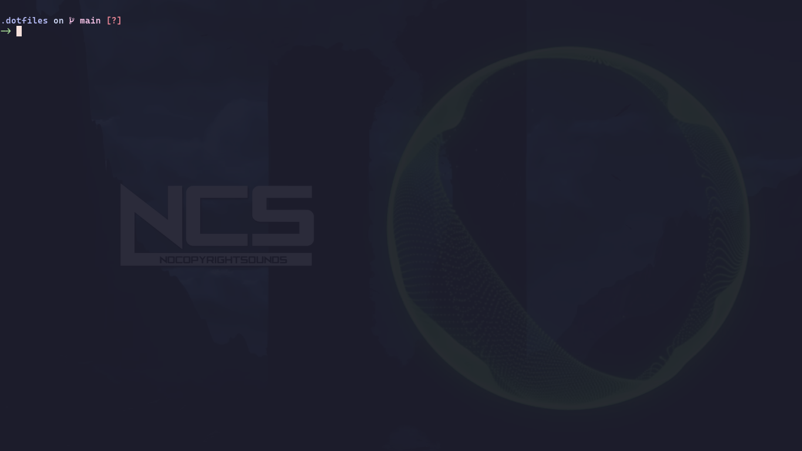

# Jarmos's Dotfiles

[](https://github.com/Jarmos-san/dotfiles/actions/workflows/qa-checks.yml)


This repository contains various "_dotfiles_" for my personal development needs.
The said dotfiles are mostly configurations for the tools I use to write code on
a daily basis.

## How to Use This Project

The contents of this repository are **VERY** personalised & might not suit
**YOUR** particular needs as-is. Hence, I strongly recommend to use the contents
of this repository as a source of reference only.

**DISCLAIMER**: Do not fork this repository & run the [scripts](./setup)
provided here to setup your system. I'll not be held responsible for any
potential data loss or system corruption in case something goes south when using
the contents of this repository. Running the automation script below to setup
everything:

```console
curl -fsSL "https://tinyurl.com/setup-dotfile" | bash -c
```

<details>
  <summary>See screenshots of what the tools look like!</summary>
  <strong>Neovim:</strong>
  
  <strong>Wezterm:</strong>
  
  <strong>Starship:</strong>


</details>

## Acknowledgements

The configurations I used are heavily inspired from other giants of the
community. Following are some of the repositories I keep an eye out for
inspiration.

- Salomon Popp's [disrupted/dotfiles](https://github.com/disrupted/dotfiles)
- Mathias Bynen's
  [mathiasbynens/dotfiles](https://github.com/mathiasbynens/dotfiles)
- [codeinthehouse's gist](https://gist.githubusercontent.com/codeinthehole/26b37efa67041e1307db/raw/67c06401c3cdb7f7f96aa9054e95cbe0e473b7f0/osx_bootstrap.sh)
- Dries Vints's [driesvints/dotfiles](https://github.com/driesvints/dotfiles)
- Tom Payne's [twpayne/dotfiles](https://github.com/twpayne/dotfiles)
- Maria José Solano's
  [MariaSolOs/dotfiles](https://github.com/MariaSolOs/dotfiles)

More will be added as & when I come across any.

## Terms & Conditions of Usage

Everything in this repository is licensed under the T&Cs of a FOSS license. More
specifically, the project is licensed under the T&Cs of the MIT License, so for
more info on it, refer to the [LICENSE](./LICENSE). So feel free to copy &
distribute any of the configurations I shared in this repository.
